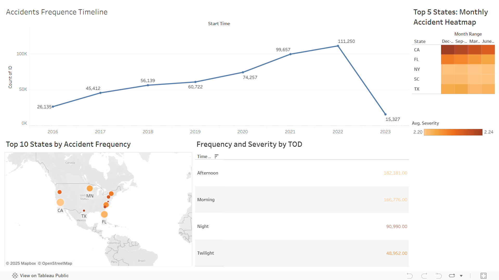

# Transportation Accidents Dashboard

## Overview
This project analyzes **500K+ U.S. vehicle accident records** to show different trends.
I cleaned and analyzed the kaggle dataset in **Python**, then built an **interactive Tableau dashboard** to show some KPIs.

## General Steps
- Cleaned and standardized 20+ columns ( duplicates, missing values, inconsistencies)  
- Analyzed accident frequency and severity patterns in Python, including categorizing dates into seasons and times of day  
- Built an interactive Tableau dashboard to compare KPIs such as:  
  - Top 10 states with the most accidents  
  - Accident patterns by season and month  
  - Severity distribution by time of day

## Dashboard
🔗 [View on Tableau Public](https://public.tableau.com/app/profile/izzat.shuhratov/viz/Transportation_Accidents_Analysis/Dashboard1)

## Code
- [Notebook.ipynb](notebook.ipynb) – data cleaning, processing, and some analysis

